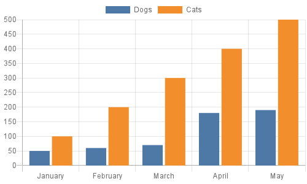

QuickChart-Js-Standalone
---

# Installation

If you are using npm:

```
npm install quickchart-js-standalone
```


[QuickChart](https://quickchart.io/) is a service that generates images of charts from a URL.  Because these charts are simple images, they are very easy to embed in non-dynamic environments such as email, SMS, chat rooms, and so on.

## See it in action

The QuickChart-Js-Standalone contains all dependency to generate charts with quickchart in a single pacakge.


Here's an example 

As you can see, the Javascript or JSON object contained in the URL defines the chart:
## Configuring your chart

```js
const QuickChartJs = require("quickchart-js-standalone")
const path = require('path')
const QuickChartJsInstance = new QuickChartJs()


QuickChartJsInstance.setConfig({
  type: 'bar',
  data: {
    labels: ['January', 'February', 'March', 'April', 'May'],
    datasets: [{
      label: 'Dogs',
      data: [50, 60, 70, 180, 190]
    }, {
      label: 'Cats',
      data: [100, 200, 300, 400, 500]
    }]
  }
});

const FILE_NAME = "./test.png"
QuickChartJsInstance.toFile(path.join(__dirname,FILE_NAME))
```




The chart configuration object is based on the popular Chart.js API.  Check out the [Chart.js documentation](https://www.chartjs.org/docs/2.9.4/charts/) for more information on how to customize your chart, or see [QuickChart documentation](https://quickchart.io/documentation#parameters) for API options.

QuickChart includes many Chart.js plugins that allow you to add chart annotations, data labels, and more: `chartjs-plugin-datalabels`, `chartjs-plugin-annotation`, `chartjs-plugin-piechart-outlabels`, `chartjs-chart-radial-gauge`, `chartjs-chart-box-and-violin-plot `, `chartjs-plugin-doughnutlabel`, and `chartjs-plugin-colorschemes`.

**Go to  the full [QuickChart documentation](https://quickchart.io/documentation) to learn more.  See [gallery](https://quickchart.io/gallery/) for examples.**


### Chart.js versions

Chart.js v3 and v4 are supported via the `version` parameter ([documentation](https://quickchart.io/documentation/) to read more about parameters).  Custom chart plugins such as annotations and outlabels currently not available for >= 3.0.0.

Each QuickChart instance should use 1 specific version of the Chart.js library.  Mixing and matching versions (e.g., rendering a v2 chart followed by a v3 chart) is not well supported.

## Dependencies and Installation

Chart generation requires several system dependencies: Cairo, Pango, libjpeg, and libgif.  Run `./scripts/setup.sh` for a fresh install on Linux machines (note that this also installs yarn, node, and monit).

To install system dependencies on Mac OSX, you probably just need to `brew install cairo pango libffi`.  You may have to `export PKG_CONFIG_PATH="/usr/local/opt/libffi/lib/pkgconfig"` before installing node packages.

Once you have system dependencies installed, run `yarn install` or `npm install` to install the node dependencies.
